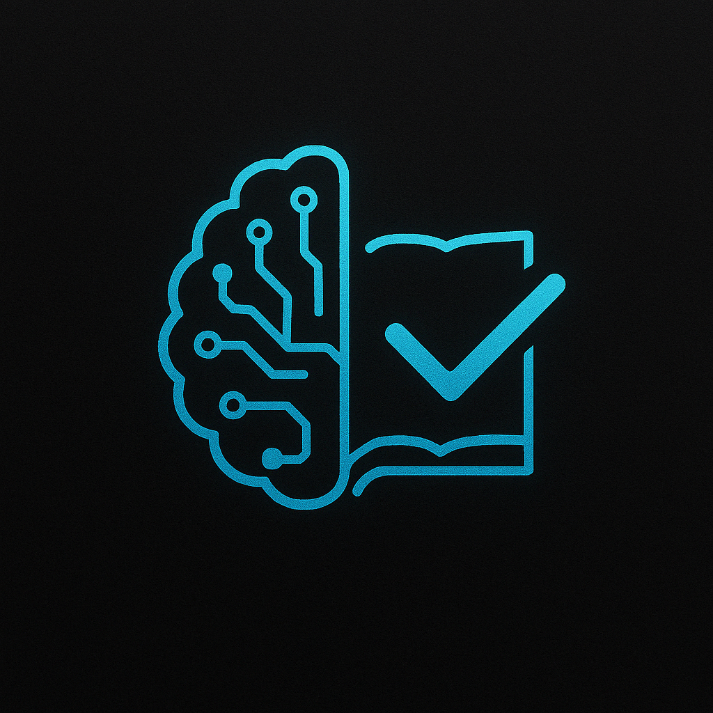

## GraderBot



In this project we explore the possibility of customized grading assistants that can provide both numeric scores and feedbacks instantly. This is an effort to decrease the workload of teaching faculty and TAs. We focus on grading subjective/writing based questions mainly as there are many tools that exist for multiple-choice and coding questions. For this project we have finetuned 2 SLMs - Facebook's Roberta-base and BART as they are lightweight and can run locally as well as with compute restrained environments. We also propose a custom dataset curation method that can be used to generated fine-tuning datasets for different subject/domain requirements as required by the teaching faculty.

We have built a small UI to demonstrate the finetuned grader assistant.

## Instructions on how to run the application
1) First clone the repository in your virtual/base environment<pre> ```git clone https://github.com/mani2001/FineTuningProjectNLP.git``` </pre>
2) Move into the folder <pre> ```cd FineTuningProjectNLP``` </pre>
3) Open the [Link](https://drive.google.com/drive/folders/1Ux9I9T5cI-MoK9orVutRuKr8PrR4dqZy?usp=sharing) and download both the folders (scoringModel and feedbackModel) - The files were slightly bigger than the accepted GitHub size.
4) Copy and paste/move the folders into the GraderApp folder.
5) Go to huggingface and create an access token by following this: [Huggingface access token](https://huggingface.co/docs/hub/en/security-tokens)
6) In GraderApp/app.py paste the token within the quotes of the login function <pre> ```login("")``` </pre>
7) Run app.py (from within the GraderApp folder)
8) go to the localhost url provided by Django (within your terminal)
9) Test the app!
    


## Fine-tuning details


## Dataset curation

## Final thoughts


